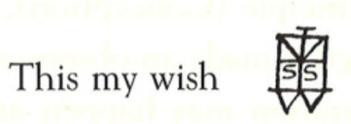
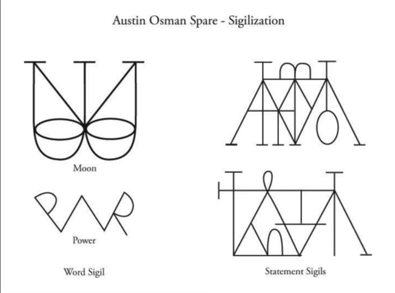
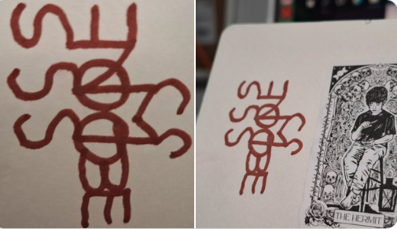
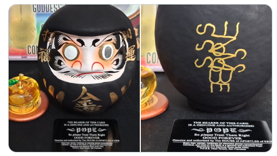

# Protocol: Sigil Making Without Removing Duplicate Letters🍏
# プロトコル：重複文字を消さないAOS流シジル作成🍏

 

   
 

 

**The sigils created by AOS do not remove duplicate characters, allowing the “S” to produce an exquisite rhythm.**\
スペアのシジルは重複文字を消さないので「S」が絶妙のリズムを生み出せる。

## Step 1

**Write your desire as a short phrase.**\
願望を短いフレーズで書く。

👉 Examples / 例：
- GET MONEY
- PASS THE EXAM
- GET PROMOTION
- PUT THE PROBLEM AWAY

潜在意識は文法を理解しない。
だから **NOT** を使う文（DON'T FAIL など）は避けられてきた。
むしろ **文法的に正しくなくても自分に響くフレーズ** を作る方が強い。
IMPOSSIBLE IS NOTHING のように。

------------------------------------------------------------------------

## Step 2

**Do NOT remove duplicate letters.**\
同じ文字を消さずに残しておく。

------------------------------------------------------------------------

## Step 3

**Arrange the letters into a design.**\
文字を組み合わせて図案にする。

------------------------------------------------------------------------

## Step 4

**Let duplicate letters create rhythm.**\
重複した文字は無駄ではない。\
同じ文字が並ぶことで、**リズムやドラムビート**を生み出す。\
その響きを図案に刻む。AOSの場合は「S」が残っていたよね。

 

------------------------------------------------------------------------

## Step 5

**Stop when it feels alive, not when it looks neat.**\
整っているかどうかよりも、「生きている」感じがしたら完成。

 

------------------------------------------------------------------------

🍏 *Essence is fine, but rhythm and messiness may be magic.*\
🍏 エッセンスもいいが、リズムと雑味こそ魔術。

**Hail Eris!🍏**
